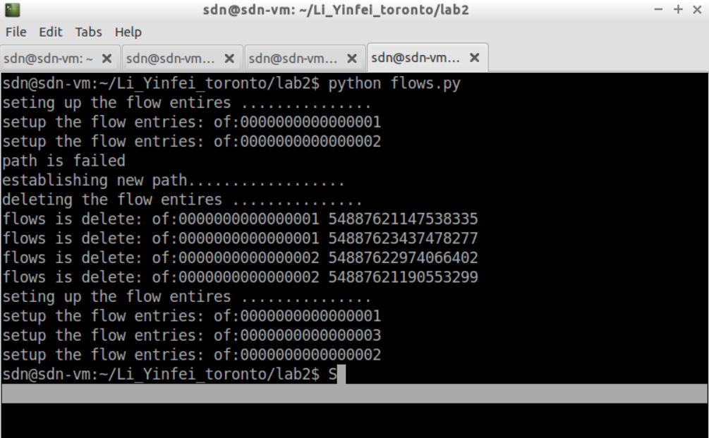

Run `/opt/onos/bin/onos-service` to enable ONOS serivce  
Use `sudo python topo.py` to setup mininet  
Make sure the topo graph is same as figure, 3 devices, 2 hosts, 6 link 

Mininet command `h1 ping h2` or `h2 ping h1` do not work 
Then Run command `python flows.py` in a new terminal  
Mininet command `h1 ping h2` or `h2 ping h1` would work 
Then run command `link s1 s2 down` in mininet 
In `flows.py` terminal will indicate the path is fail and then replace with a new flow entries

